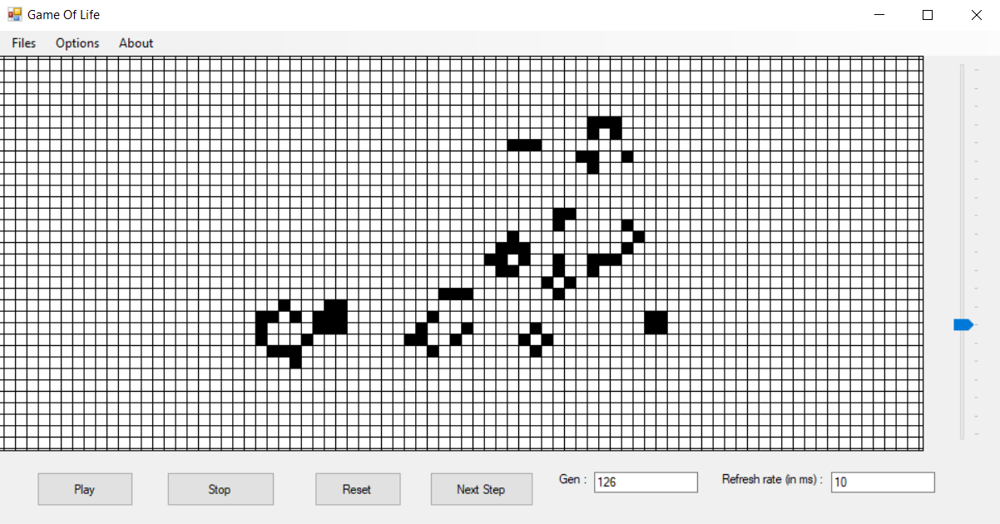

# GameOfLifeCS

---
## Description 

To test my C# knowledge, I decided to recreate the Game of life by John Conway.

>The Game of Life, also known simply as Life, is a cellular automaton devised by the British mathematician John Horton Conway in 1970. It is a zero-player game, meaning that its evolution is determined by its initial state, requiring no further input. One interacts with the Game of Life by creating an initial configuration and observing how it evolves. It is Turing complete and can simulate a universal constructor or any other Turing machine. 

If you want to look deeper into the subject and rules of this game, you can see it right [here](https://en.wikipedia.org/wiki/Conway%27s_Game_of_Life) 

---
## How to use

You can run this program, with Visual Studio 2019.

Here is what the GUI looks like 

You can **add a cell** by just clicking on the grid.
You can also **zoom in and out** with the slider on the right.